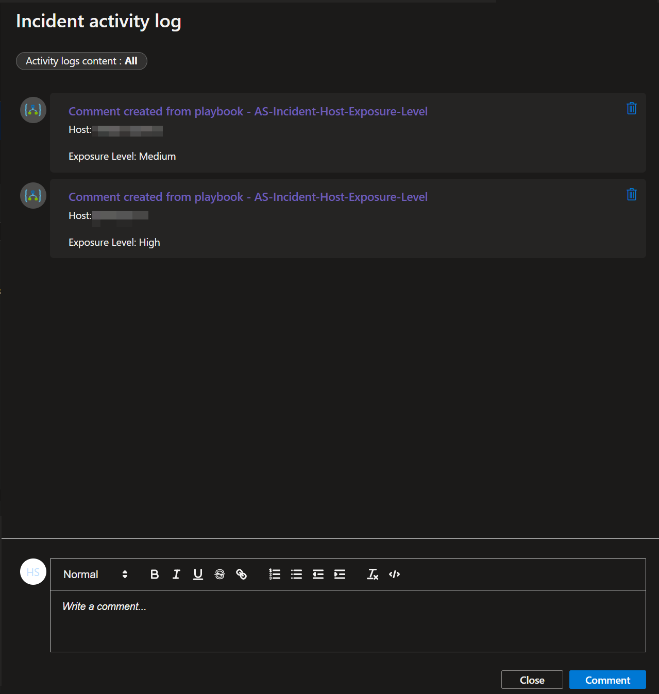
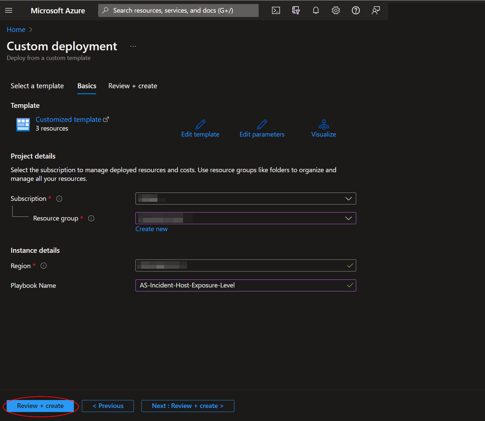
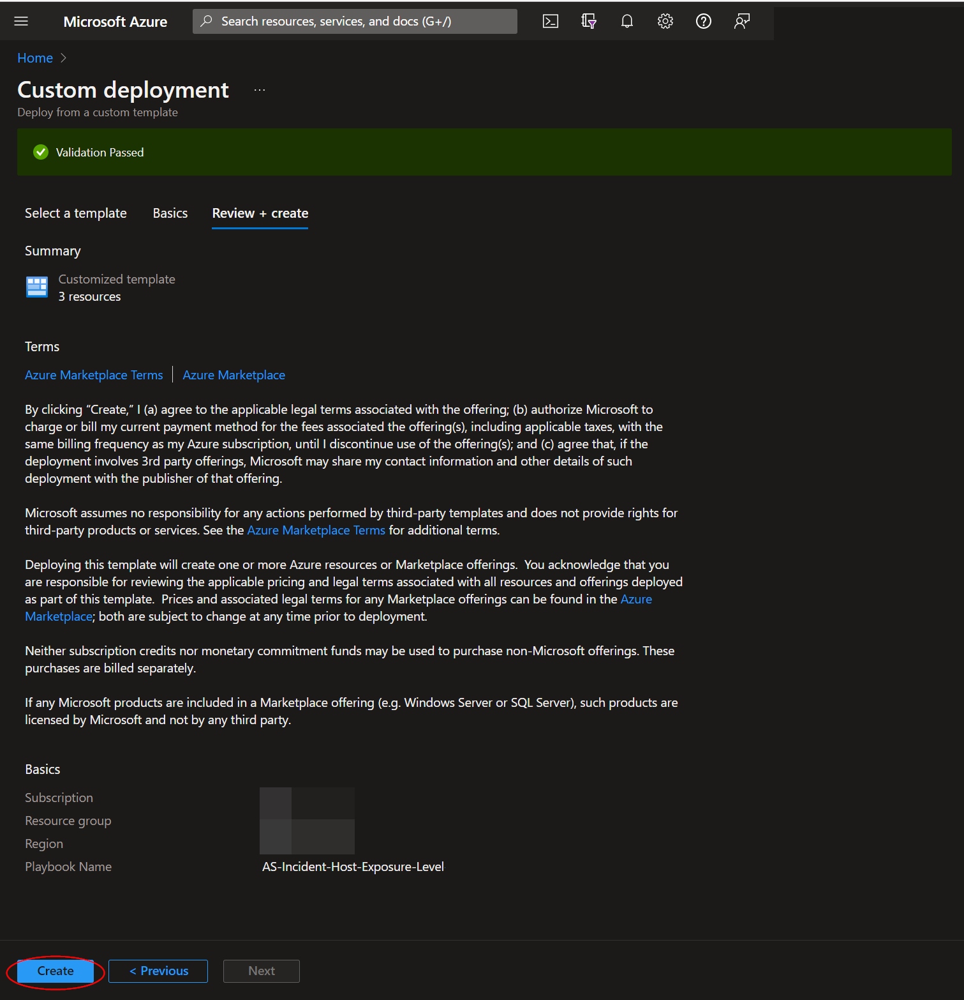
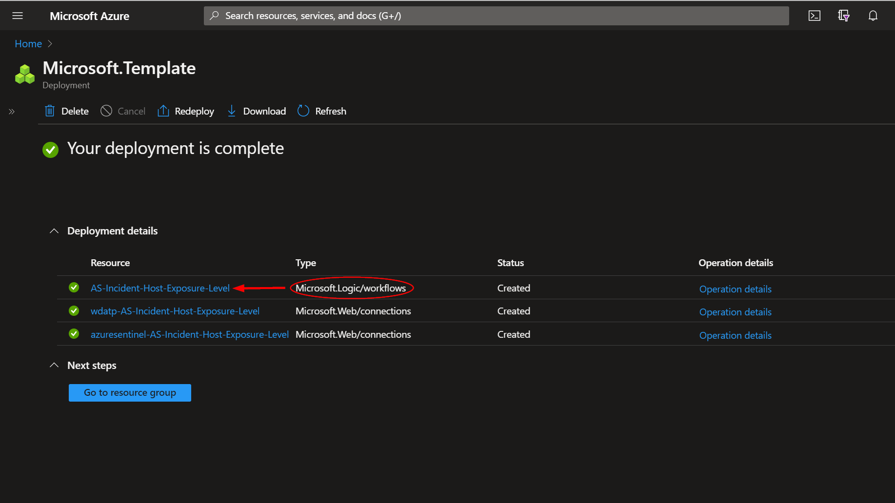
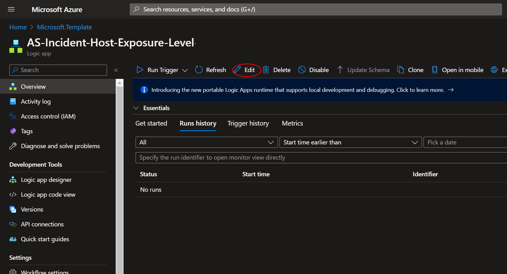
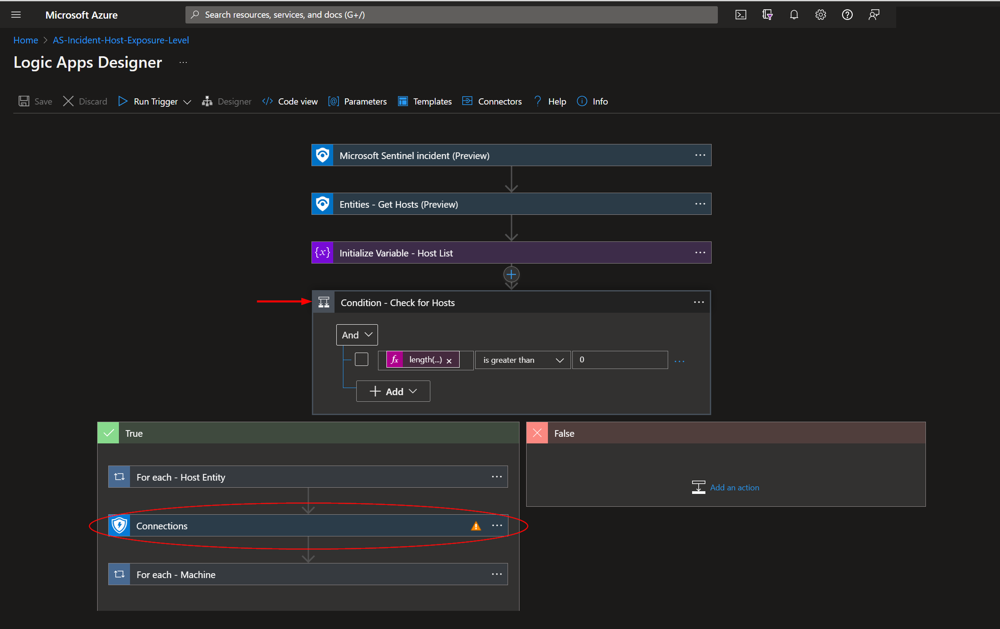
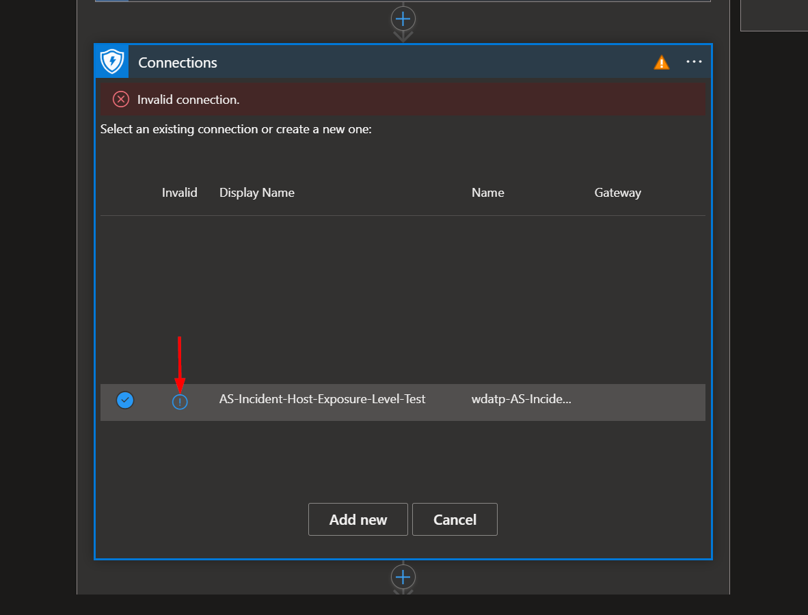
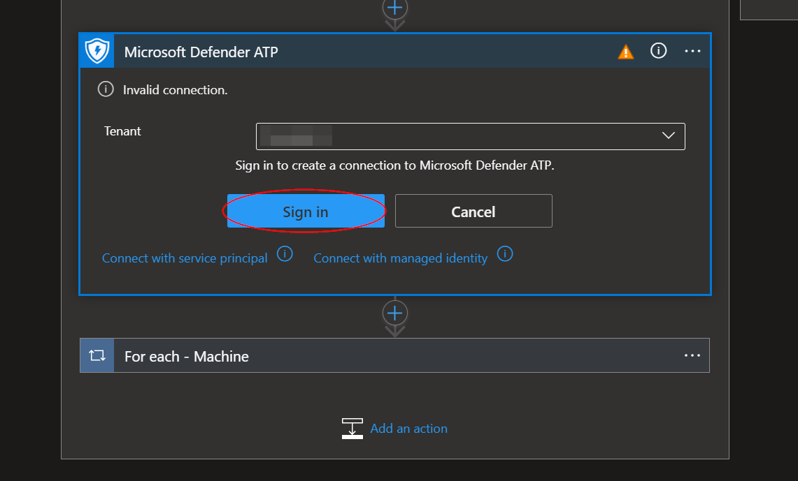
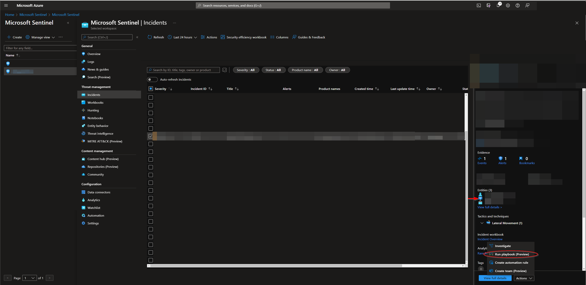
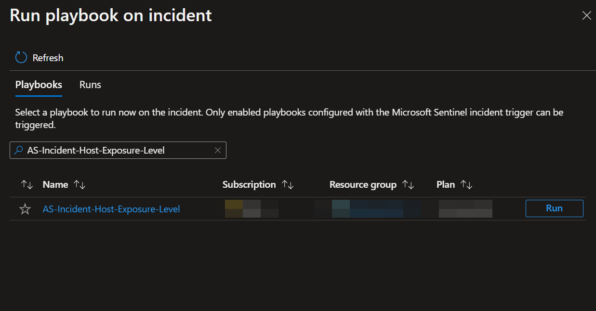

# AS-Incident-Host-Exposure-Level

Author: Accelerynt

For any technical questions, please contact info@accelerynt.com  

       

This playbook is intended to be run from a Microsoft Sentinel Incident. It will match the Hosts from a Microsoft Sentinel Incident with Microsoft Defender Machines and add each Machine's exposure level as a comment on the Microsoft Sentinel Incident.
                                                                                                                                     

#
### Deployment                                                                                                         
                                                                                                        
To configure and deploy this playbook:
 
Open your browser and ensure you are logged into your Microsoft Sentinel workspace. In a separate tab, open the link to our playbook on the Accelerynt Security GitHub Repository:

https://github.com/Accelerynt-Security/AS-Incident-Host-Exposure-Level

                                             

Click the “**Deploy to Azure**” button at the bottom and it will bring you to the custom deployment template.

In the **Project Details** section:

* Select the “**Subscription**” and “**Resource Group**” from the dropdown boxes you would like the playbook deployed to.  

In the **Instance Details** section:   

* **Playbook Name**: This can be left as "**AS-Incident-Host-Exposure-Level**" or you may change it.

Towards the bottom, click on “**Review + create**”. 

Once the resources have validated, click on "**Create**".

The resources should take around a minute to deploy. Once the deployment is complete, you can expand the "**Deployment details**" section to view them.
Click the one corresponding to the Logic App.

Click on the “**Edit**” button. This will bring us into the Logic Apps Designer.

The first and seconds steps labeled "**Connections**" use a shared azuresentinel connection created during the deployment of this playbook. Before the playbook can be run, this connection will either need to be authorized, or an existing authorized connection may be alternatively selected for each.  

To validate the azuresentinel connection created for this playbook, expand either of the "**Connections**" steps and click the exclamation point icon next to the name matching the playbook.
                                                                                                

When prompted, sign in to validate the connection.                                                                                                
                                                                                                
                                                                                                                                                                                                                                                   
Since the first two steps share the same connection, there is no need to repeat the process here. Simply refresh the page to ensure the first two steps now have valid connections.

This process will need to be repeated for the two wdatp connections, responsible for communicating with Microsoft Defender. Expand the step labeled "**Condition - Check for Hosts**"

Repeat the same process above for the connection used in the indicated steps.

#
### Running the Playbook 

To run this playbook from a Microsoft Sentinel incident, navigate to Microsoft Sentinel:

https://portal.azure.com/#view/HubsExtension/BrowseResource/resourceType/microsoft.securityinsightsarg%2Fsentinel

Select a workspace and then click the "**Incidents**" menu option located under "**Threat management**". Select an incident with compromised host entities.

Click on the "**Action**" list button on the bottom right of the screen and select "**Run playbook**".

From the "**Run playbook on incident**" view, type "**AS-Incident-Host-Exposure-Level**" into the search bar, then click run.

